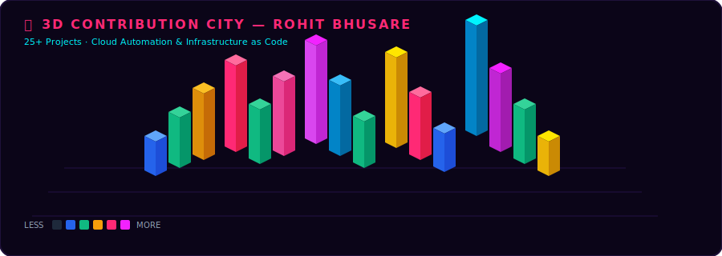

<!-- ═══════════════════════════════════════════════════════════════════ -->
<!--   ROHIT BHUSARE — ULTIMATE DEVOPS PORTFOLIO                        -->
<!--   GitHub: rbhusare829                                              -->
<!-- ═══════════════════════════════════════════════════════════════════ -->

<div align="center">

<!-- HERO BANNER -->


<br/>

<!-- TYPING ANIMATION -->
[](https://github.com/rbhusare829)

<br/>

<!-- PROFILE BADGES -->
[](https://github.com/rbhusare829)
[](https://github.com/rbhusare829?tab=followers)
[](https://github.com/rbhusare829?tab=repositories)
[](mailto:rbhusare829@gmail.com)

</div>

---

## 🧑‍💻 About Me


```yaml
name       : Rohit Bhusare
location   : Pune, Maharashtra, India
role       : DevOps & Cloud Engineer
focus      : AWS · Terraform · Kubernetes · CI/CD

skills:
  cloud    : [AWS EC2, VPC, RDS, S3, EFS, IAM, CloudWatch]
  IaC      : [Terraform, Ansible]
  cicd     : [Jenkins, GitHub Actions]
  containers: [Docker, Kubernetes]
  os       : [Linux, Ubuntu, RHEL]
  languages: [Python, Bash, YAML]

mission    : "Zero manual steps. Zero downtime. Full automation."
status     : Open to Work
```

<br clear="right"/>

---

## ⚡ Tech Stack

<div align="center">

<!-- Core icons row 1 -->


<br/><br/>

<!-- Core icons row 2 -->


</div>

<br/>

<details>
<summary><b>📋 Full Arsenal — Click to Expand</b></summary>
<br/>

| Layer | Tools |
|:------|:------|
| ☁️ **Cloud** |        |
| 🔍 **Monitoring** |   |
| 🏗️ **IaC** |   |
| 🔁 **CI/CD** |   |
| 🐳 **Containers** |   |
| 🌐 **Web & DB** |     |
| 💻 **Languages** |    |

</details>

---

## 🚀 Live CI/CD Pipeline

<div align="center">

</div>

---

## 📂 Featured Projects

<div align="center">

<a href="https://github.com/rbhusare829/PROJECT1-AWS-Monitoring-Security-Automation">

</a>
<a href="https://github.com/rbhusare829/Terraform-3-Tier-Architecture-on-AWS">

</a>

<a href="https://github.com/rbhusare829/Kubernetes-Multi-Node-Setup-with-AWS-EFS-NFS-Storage-">

</a>
<a href="https://github.com/rbhusare829/Cloud-Native-E-Commerce-Deployment-Using-Terraform-AWS-EC2-RDS-Jenkins-CI-CD-Public">

</a>

<a href="https://github.com/rbhusare829/3-Tier-Web-Application-using-Docke">

</a>
<a href="https://github.com/rbhusare829/PROJECT2-AWS-VPC-Flow-Logs">

</a>

</div>

<details>
<summary><b>🔽 View All Projects</b></summary>
<br/>

| # | Project | Description | Stack |
|:--|:--------|:------------|:------|
| 1 | [Jenkins Log Monitor](https://github.com/rbhusare829/Project-5-jenkins-log-monitor) | Automated Jenkins log monitoring + alerting | `Jenkins` `Bash` |
| 2 | [Backup Automation](https://github.com/rbhusare829/backup-automation-project) | Scheduled backups with rotation | `Shell` `Cron` |
| 3 | [Ansible LAMP/LEMP](https://github.com/rbhusare829/Ansible-EC2-LAMP-LEMP) | Auto-provision LAMP & LEMP on EC2 | `Ansible` `EC2` |
| 4 | [Ansible 2-Tier Deploy](https://github.com/rbhusare829/Ansible-2-Tier-Application-Deployment) | NGINX + PHP + MariaDB deploy | `Ansible` `MariaDB` |
| 5 | [Static Website CI/CD](https://github.com/rbhusare829/static-website-project-2) | Terraform + Jenkins + AWS pipeline | `Terraform` `Jenkins` |
| 6 | [WordPress on Docker](https://github.com/rbhusare829/WordPress-Containerization-Using-Docker) | WordPress + MySQL containerized | `Docker` `MySQL` |

<div align="center">

[](https://github.com/rbhusare829?tab=repositories)

</div>
</details>

---

## 🏙️ 3D Contribution City

<div align="center">

</div>

---

## 📊 GitHub Stats

<div align="center">


&nbsp;


<br/><br/>


<br/><br/>


<br/><br/>


</div>

---

## 🐍 Contribution Snake

<div align="center">

</div>

---

## 🤝 Connect With Me

<div align="center">

<a href="https://www.linkedin.com/in/rbhusare829/">

</a>&nbsp;&nbsp;
<a href="mailto:rbhusare829@gmail.com">

</a>&nbsp;&nbsp;
<a href="https://github.com/rbhusare829">

</a>

<br/><br/>


<br/><br/>

> ⚡ **If automation can do it, it should. If a human is doing it, something is wrong.**

<br/>

**Thanks for visiting! Don't forget to star ⭐ a repo if you found it useful!**

</div>

<!-- FOOTER -->
<div align="center">

</div>
