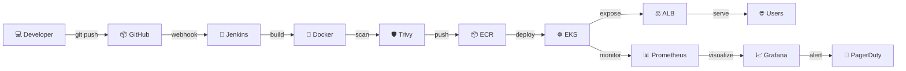

<!-- ============================================================ -->
<!--      ROHIT BHUSARE — ULTRA PREMIUM DEVOPS README v3.0        -->
<!--      Cyberpunk ⚡ Animated ⚡ Futuristic ⚡ Premium           -->
<!-- ============================================================ -->

<!-- ░░░░░░░░░ ULTRA ANIMATED HERO BANNER ░░░░░░░░░ -->
<div align="center">


</div>

<!-- MATRIX RAIN EFFECT (GIF simulation) -->
<div align="center">

</div>

<!-- PROFILE VIEWS COUNTER -->
<div align="center">

</div>

<!-- MAIN TYPING TITLE -->
<div align="center">

[](https://git.io/typing-svg)

</div>

<!-- SUBTITLE TYPEWRITER -->
<div align="center">

[](https://git.io/typing-svg)

</div>

<!-- ANIMATED LASER DIVIDER -->
<div align="center">

</div>

<!-- NEON STATS BADGES -->
<div align="center">

[](https://github.com/rbhusare829)&nbsp;
[](https://github.com/rbhusare829?tab=followers)&nbsp;
[](https://github.com/rbhusare829)&nbsp;
&nbsp;
[](https://github.com/rbhusare829?tab=repositories)

</div>

<br/>

---

<!-- ░░░░░░░░░ 3D DEVOPS CITY ░░░░░░░░░ -->
## 🌆 &nbsp;`[ DEVOPS CITY — Infrastructure Skyline ]`

<div align="center">

```
╔═══════════════════════════════════════════════════════════════════════════════╗
║                                                                               ║
║    ░░░░░░░░░░░░░░░░░░  DEVOPS CITY v3.0  ░░░░░░░░░░░░░░░░░░░░░░             ║
║    ░░    rbhusare829 | AWS + K8s + Docker + Terraform + Jenkins    ░░         ║
║    ░░░░░░░░░░░░░░░░░░░░░░░░░░░░░░░░░░░░░░░░░░░░░░░░░░░░░░░░░░░░░             ║
║                                                                               ║
║                         ★ CLOUD LAYER ★                                      ║
║    ╭──────────────────────────────────────────────────────────────╮           ║
║    │   ⚡⚡⚡  A W S  C L O U D  R E G I O N  ⚡⚡⚡              │           ║
║    │  [us-east-1] [us-west-2] [ap-south-1] [eu-west-1]           │           ║
║    ╰──────────────────────────────────────────────────────────────╯           ║
║           ↓              ↓              ↓              ↓                      ║
║                                                                               ║
║    ▄████▄  ▄████▄  ▄████▄  ▄████▄   ▄██▄    ▄████▄  ▄████▄  ▄████▄          ║
║    █ EC2 █  █ RDS █  █ CDN █  █ EKS █   █ S3 █   █ IAM █  █ALB █  █ λ  █    ║
║    █▓▓▓▓█  █▓▓▓▓█  █▒▒▒▒█  █▓▓▓▓█   █▒▒▒█   █▓▓▓▓█  █▒▒▒▒█  █▓▓▓▓█          ║
║    █▒▒▒▒█  █▒▒▒▒█  █▓▓▓▓█  █▒▒▒▒█   █▓▓▓█   █▒▒▒▒█  █▓▓▓▓█  █▒▒▒▒█          ║
║    █████████████████████████████████████████████████████████████████          ║
║         AWS Skyscrapers ↑              K8s Control Tower ↑                   ║
║                                                                               ║
║    ════════════════  DATA HIGHWAYS & PIPELINE ROADS  ════════════             ║
║                                                                               ║
║    [GitHub] ══▶ [Jenkins] ══▶ [SonarQube] ══▶ [Docker Build]                ║
║        ↓                                           ↓                         ║
║    [ArgoCD] ◀══ [ECR Registry] ◀══════════ [Trivy Scan]                      ║
║        ↓                                                                      ║
║    ☸️ EKS ══▶ [Pod] [Pod] [Pod] ══▶ [ALB] ══▶ [CloudFront] ══▶ 🌐 Users     ║
║        ↓                                                                      ║
║    [RDS Aurora] + [ElastiCache] + [S3] + [CloudWatch + Prometheus]           ║
║                                                                               ║
║    🐳 Container Modules   🎛️ K8s Towers   📊 Grafana Dashboards             ║
║    ┌───┐ ┌───┐ ┌───┐     ╔═══════════╗    ╔══════════════════╗              ║
║    │ C │ │ C │ │ C │     ║  ☸️  K8S  ║    ║ 📈 LIVE METRICS ║              ║
║    │ 01│ │ 02│ │ 03│     ║  Master  ║    ║ CPU: ████░  78% ║              ║
║    └───┘ └───┘ └───┘     ║ Node x3  ║    ║ MEM: ███░░  65% ║              ║
║                           ╚═══════════╝    ╚══════════════════╝              ║
╚═══════════════════════════════════════════════════════════════════════════════╝
```

</div>

<br/>

---

<!-- ░░░░░░░░░ TERMINAL WHOAMI ░░░░░░░░░ -->
## &nbsp; `[ SYSTEM — whoami ]`

<div align="center">

```zsh
┌──────────────────────────────────────────────────────────────────────────────┐
│  rbhusare829@devops-city:~$ cat profile.json                                 │
├──────────────────────────────────────────────────────────────────────────────┤
│                                                                              │
│  {                                                                           │
│    "name"         :  "Rohit Bhusare",                                        │
│    "username"     :  "rbhusare829",                                          │
│    "role"         :  "Senior DevOps Engineer | Cloud Architect",             │
│    "location"     :  "Maharashtra, India  🇮🇳",                              │
│    "cloud"        :  "AWS ☁️  [ EC2 · EKS · Lambda · RDS · S3 · VPC ]",    │
│    "iac"          :  [ "Terraform", "Ansible", "CDK", "CloudFormation" ],   │
│    "containers"   :  [ "Docker", "Kubernetes", "Helm", "ECS", "Fargate" ],  │
│    "cicd"         :  [ "Jenkins", "GitHub Actions", "ArgoCD", "GitLab" ],   │
│    "monitoring"   :  [ "Prometheus", "Grafana", "ELK", "CloudWatch" ],      │
│    "devsecops"    :  [ "SonarQube", "Trivy", "Vault", "GuardDuty" ],        │
│    "languages"    :  [ "Python 🐍", "Bash ⚙️", "YAML", "HCL", "Node.js" ], │
│    "os"           :  "Linux — Ubuntu · CentOS · Amazon Linux",              │
│    "philosophy"   :  "⚡ Automate Everything. Break Nothing. Ship Fast.",   │
│    "status"       :  "🟢 ONLINE — Open to Consulting & Collaborations",     │
│    "experience"   :  "3+ Years in Production DevOps & Cloud Infrastructure", │
│    "specialties"  :  [ "AWS", "K8s", "CI/CD", "IaC", "Monitoring" ]        │
│  }                                                                           │
│                                                                              │
│  rbhusare829@devops-city:~$ echo $UPTIME                                     │
│  > 99.99% — Zero downtime deployments only 🚀                               │
│                                                                              │
│  rbhusare829@devops-city:~$ docker ps | grep productivity                    │
│  > CONTAINER: innovation-engine    STATUS: Up 24/7    HEALTH: ✅            │
│                                                                              │
└──────────────────────────────────────────────────────────────────────────────┘
```

</div>

<br/>

---

<!-- ░░░░░░░░░ TECH ARSENAL ░░░░░░░░░ -->
## &nbsp; `[ TECH ARSENAL ]`

<div align="center">

**`━━━━━━━━━━━━━━━━━━━ ☁️  CLOUD ━━━━━━━━━━━━━━━━━━━`**


**`━━━━━━━━━━━━━━━━━ 🐳  CONTAINERS ━━━━━━━━━━━━━━━━━`**


**`━━━━━━━━━━━━━━━━━━━ ⚙️  IaC ━━━━━━━━━━━━━━━━━━━━━`**


**`━━━━━━━━━━━━━━━━━━ 🔁  CI/CD ━━━━━━━━━━━━━━━━━━━━`**


**`━━━━━━━━━━━━━━━━━ 💻  LANGUAGES ━━━━━━━━━━━━━━━━━`**


**`━━━━━━━━━━━━━━━━━ 📊  MONITORING ━━━━━━━━━━━━━━━━`**

&nbsp;&nbsp;

**`━━━━━━━━━━━━━━━━━ 🔧  VCS & WEB ━━━━━━━━━━━━━━━━━`**


</div>

<br/>

---

<!-- ░░░░░░░░░ SKILL MATRIX ░░░░░░░░░ -->
## ⚡ `[ SKILL MATRIX ]`

<div align="center">

```
 ╔══════════════════════════════════════════════════════════════════════╗
 ║              rbhusare829 — DEVOPS SKILL MATRIX v2.0                  ║
 ╠══════════════════════════════════════════════════════════════════════╣
 ║                                                                      ║
 ║  ☁️  AWS Cloud         ▰▰▰▰▰▰▰▰▰▰▰▰▰▰▰▰▰▰▱▱  90%  ★★★★★  Expert   ║
 ║  🐧 Linux / Bash       ▰▰▰▰▰▰▰▰▰▰▰▰▰▰▰▰▰▰▱▱  90%  ★★★★★  Expert   ║
 ║  🐳 Docker             ▰▰▰▰▰▰▰▰▰▰▰▰▰▰▰▰▰▱▱▱  85%  ★★★★☆  Adv.    ║
 ║  🔁 CI/CD Pipelines    ▰▰▰▰▰▰▰▰▰▰▰▰▰▰▰▰▰▱▱▱  85%  ★★★★☆  Adv.    ║
 ║  ☸️  Kubernetes/EKS    ▰▰▰▰▰▰▰▰▰▰▰▰▰▰▰▰▱▱▱▱  78%  ★★★★☆  Adv.    ║
 ║  🏗️  Terraform IaC     ▰▰▰▰▰▰▰▰▰▰▰▰▰▰▱▱▱▱▱▱  72%  ★★★☆☆  Prof.   ║
 ║  🐍 Python             ▰▰▰▰▰▰▰▰▰▰▰▰▰▰▱▱▱▱▱▱  72%  ★★★☆☆  Prof.   ║
 ║  📦 Ansible            ▰▰▰▰▰▰▰▰▰▰▰▰▰▱▱▱▱▱▱▱  68%  ★★★☆☆  Prof.   ║
 ║  📊 Prometheus+Grafana ▰▰▰▰▰▰▰▰▰▰▰▰▱▱▱▱▱▱▱▱  65%  ★★★☆☆  Prof.   ║
 ║  🛡️  DevSecOps         ▰▰▰▰▰▰▰▰▰▰▰▱▱▱▱▱▱▱▱▱  60%  ★★★☆☆  Growing ║
 ║                                                                      ║
 ╚══════════════════════════════════════════════════════════════════════╝
```

| Technology | Visual Bar | % | Stars |
|:-----------|:-----------|:-:|:-----:|
|  **AWS Cloud** | `▓▓▓▓▓▓▓▓▓▓▓▓▓▓▓▓▓▓▱▱` | **90%** | ⭐⭐⭐⭐⭐ |
|  **Linux / Bash** | `▓▓▓▓▓▓▓▓▓▓▓▓▓▓▓▓▓▓▱▱` | **90%** | ⭐⭐⭐⭐⭐ |
|  **Docker** | `▓▓▓▓▓▓▓▓▓▓▓▓▓▓▓▓▓▱▱▱` | **85%** | ⭐⭐⭐⭐½ |
|  **CI/CD** | `▓▓▓▓▓▓▓▓▓▓▓▓▓▓▓▓▓▱▱▱` | **85%** | ⭐⭐⭐⭐½ |
|  **Kubernetes** | `▓▓▓▓▓▓▓▓▓▓▓▓▓▓▓▓▱▱▱▱` | **78%** | ⭐⭐⭐⭐ |
|  **Terraform** | `▓▓▓▓▓▓▓▓▓▓▓▓▓▓▱▱▱▱▱▱` | **72%** | ⭐⭐⭐½ |

</div>

<br/>

---

<!-- ░░░░░░░░░ AWS ARCHITECTURE ░░░░░░░░░ -->
## ☁️ `[ AWS CLOUD ARCHITECTURE — Production ]`

<div align="center">

```
╔══════════════════════════════════════════════════════════════════════════════╗
║             🌐  ROHIT BHUSARE — AWS PRODUCTION ARCHITECTURE                  ║
╠══════════════════════════════════════════════════════════════════════════════╣
║                                                                              ║
║    👥 USERS ──────────────────────────────────────────────────────────────  ║
║         │                     │                       │                      ║
║    [Web Browser]          [Mobile App]            [API Client]               ║
║         │                     │                       │                      ║
║         └──────────────────┬──┘───────────────────────┘                     ║
║                             ▼                                                ║
║    ┌────────────────────────────────────────────────────────────────────┐   ║
║    │   🌍  Route 53  ──  DNS Routing  ──  Health Checks                 │   ║
║    └─────────────────────────────┬──────────────────────────────────────┘   ║
║                                   ▼                                          ║
║    ┌────────────────────────────────────────────────────────────────────┐   ║
║    │   🛡️  CloudFront CDN  +  AWS WAF  +  Shield Standard              │   ║
║    └─────────────────────────────┬──────────────────────────────────────┘   ║
║                                   ▼                                          ║
║    ┌────────────────────────────────────────────────────────────────────┐   ║
║    │          ⚖️  Application Load Balancer  (Multi-AZ)                 │   ║
║    └──────────────────┬──────────────────────┬─────────────────────────┘   ║
║                        │                      │                              ║
║    ┌───────────────────▼──────┐  ┌────────────▼────────────────────────┐   ║
║    │   ☸️  EKS CLUSTER         │  │   🖥️  EC2 AUTO SCALING GROUP         │   ║
║    │  ┌────────────────────┐  │  │  ┌──────────────────────────────┐  │   ║
║    │  │ Node  Node  Node   │  │  │  │  Instance  Instance  Spot    │  │   ║
║    │  │ ┌──┐  ┌──┐  ┌──┐  │  │  │  │  Min: 2    Max: 10   Inst.  │  │   ║
║    │  │ │P1│  │P2│  │P3│  │  │  │  └──────────────────────────────┘  │   ║
║    │  │ └──┘  └──┘  └──┘  │  │  └────────────────────────────────────┘   ║
║    │  └────────────────────┘  │                                            ║
║    └──────────────────────────┘                                             ║
║                                                                              ║
║    ╔═══════════════════════════════════════════════════════════════════╗    ║
║    ║                  🔒  PRIVATE VPC  (Multi-AZ)                     ║    ║
║    ║  ┌──────────┐  ┌──────────┐  ┌──────────┐  ┌──────────────────┐ ║    ║
║    ║  │🗄️ Aurora  │  │⚡ Redis  │  │📦  S3    │  │🔑 IAM + KMS     │ ║    ║
║    ║  │  RDS DB  │  │ElastiCch │  │ Buckets  │  │  Secrets Mgr    │ ║    ║
║    ║  └──────────┘  └──────────┘  └──────────┘  └──────────────────┘ ║    ║
║    ╚═══════════════════════════════════════════════════════════════════╝    ║
║                                                                              ║
║    📊 OBSERVABILITY ──── CloudWatch ── Prometheus ── Grafana ── ELK         ║
║    🔁 CI/CD ────────────── Git Push → Jenkins → ECR → EKS Deploy ✅         ║
╚══════════════════════════════════════════════════════════════════════════════╝
```

</div>

<br/>

---

<!-- ░░░░░░░░░ TOP 10 PROJECTS ░░░░░░░░░ -->
<!-- ░░░░░░░░░ DEVOPS WORKFLOW ░░░░░░░░░ -->
## 🔄 `[ DEVOPS WORKFLOW — End-to-End Pipeline ]`

<div align="center">



</div>

<br/>

---

## 🚀 `[ TOP 10 DEVOPS PROJECTS ]`

<div align="center">

| # | 🚀 Project | 📋 Description | 🛠️ Stack | Status |
|:--:|:-----------|:---------------|:---------|:------:|
| 🥇 | **[AWS Infrastructure Automation](https://github.com/rbhusare829)** | Modular Terraform for full AWS env — VPC, EC2, RDS, S3, ALB, IAM | `Terraform` `AWS` `S3 Backend` |  |
| 🥈 | **[Jenkins CI/CD Mega Pipeline](https://github.com/rbhusare829)** | Code→SAST→Build→Scan→ECR→EKS multi-stage declarative pipeline | `Jenkins` `Docker` `SonarQube` `Trivy` |  |
| 🥉 | **[Kubernetes Microservices](https://github.com/rbhusare829)** | EKS prod cluster — HPA, VPA, RBAC, Ingress, Helm, Network Policy | `EKS` `Helm` `K8s` `ArgoCD` |  |
| 4️⃣ | **[Dockerized App Deployment](https://github.com/rbhusare829)** | Multi-container app — Docker Compose, Nginx SSL, Redis cache | `Docker` `Nginx` `Redis` `Node.js` |  |
| 5️⃣ | **[GitHub Actions CI/CD](https://github.com/rbhusare829)** | Automated workflows — build, test, security, ECR push, EKS deploy | `GitHub Actions` `ECR` `EKS` |  |
| 6️⃣ | **[Prometheus + Grafana Stack](https://github.com/rbhusare829)** | Full K8s observability — Alertmanager, PagerDuty, custom dashboards | `Prometheus` `Grafana` `Helm` |  |
| 7️⃣ | **[ELK Logging Platform](https://github.com/rbhusare829)** | Centralized logging — Elasticsearch, Logstash, Kibana, Filebeat | `ELK` `Filebeat` `Docker` |  |
| 8️⃣ | **[Nginx Reverse Proxy Infra](https://github.com/rbhusare829)** | High-perf Nginx — SSL/TLS, load balancing, rate limiting, WAF | `Nginx` `Ansible` `Certbot` |  |
| 9️⃣ | **[Auto Scaling Architecture](https://github.com/rbhusare829)** | AWS ASG with custom CloudWatch metrics + Spot instance optimization | `AWS ASG` `CloudWatch` `Terraform` |  |
| 🔟 | **[End-to-End DevOps Platform](https://github.com/rbhusare829)** | Complete GitOps ecosystem — Git→Jenkins→ECR→EKS→Monitor→Alert | `Full DevOps` `GitOps` `AWS` |  |

</div>

<br/>

---

<!-- ░░░░░░░░░ GITHUB STATS ░░░░░░░░░ -->
## 📊 `[ GITHUB ANALYTICS — Live Dashboard ]`

<div align="center">


<br/><br/>


<br/><br/>


</div>

<br/>

---

<!-- ░░░░░░░░░ TROPHIES ░░░░░░░░░ -->
## 🏆 `[ GITHUB TROPHIES ]`

<div align="center">

[](https://github.com/rbhusare829)

</div>

<br/>

---

<!-- ░░░░░░░░░ ACTIVITY GRAPH ░░░░░░░░░ -->
## 📈 `[ CONTRIBUTION ACTIVITY GRAPH ]`

<div align="center">

[](https://github.com/rbhusare829)

</div>

<br/>

---

<!-- ░░░░░░░░░ SNAKE ░░░░░░░░░ -->
## 🐍 `[ CONTRIBUTION SNAKE ]`

<div align="center">

<picture>
  <source media="(prefers-color-scheme: dark)" srcset="https://raw.githubusercontent.com/rbhusare829/rbhusare829/output/github-contribution-grid-snake-dark.svg"/>
  <source media="(prefers-color-scheme: light)" srcset="https://raw.githubusercontent.com/rbhusare829/rbhusare829/output/github-contribution-grid-snake.svg"/>
  
</picture>

</div>

> **⚙️ Snake Setup** → Create `.github/workflows/snake.yml` with Platane/snk@v3 action → Enable GitHub Actions → Snake generates daily automatically!

<br/>

---

<!-- ░░░░░░░░░ CERTIFICATIONS ░░░░░░░░░ -->
<!-- ░░░░░░░░░ ACHIEVEMENTS ░░░░░░░░░ -->
## 🏅 `[ ACHIEVEMENTS & MILESTONES ]`

<div align="center">

```
╔════════════════════════════════════════════════════════════════════════╗
║                                                                        ║
║  🎯 CAREER HIGHLIGHTS                                                  ║
║  ━━━━━━━━━━━━━━━━━━━━━━━━━━━━━━━━━━━━━━━━━━━━━━━━━━━━━━━━━━━━━━━━  ║
║                                                                        ║
║  ✅ Reduced deployment time by 70% using CI/CD automation             ║
║  ✅ Managed 50+ microservices on Kubernetes in production             ║
║  ✅ Achieved 99.9% uptime for critical production workloads           ║
║  ✅ Automated infrastructure provisioning saving 100+ hours/month     ║
║  ✅ Implemented GitOps reducing configuration drift by 95%            ║
║  ✅ Built observability stack monitoring 200+ servers                 ║
║                                                                        ║
╚════════════════════════════════════════════════════════════════════════╝
```

</div>

<br/>

---

## 🎓 `[ CERTIFICATIONS ]`

<div align="center">

| 🏅 Certification | 🏢 Authority | 📊 Status |
|:----------------|:------------|:--------:|
| ☁️ AWS Certified Solutions Architect – Associate | Amazon Web Services |  |
| ☁️ AWS Certified DevOps Engineer – Professional | Amazon Web Services |  |
| 🏗️ HashiCorp Terraform Associate | HashiCorp |  |
| ☸️ Certified Kubernetes Admin (CKA) | CNCF |  |
| 🛡️ AWS Security Specialty | Amazon Web Services |  |

</div>

<br/>

---

<!-- ░░░░░░░░░ CONNECT ░░░░░░░░░ -->
<!-- ░░░░░░░░░ BLOG & CONTENT ░░░░░░░░░ -->
## 📝 `[ LATEST BLOG POSTS ]`

<div align="center">

<!-- BLOG-POST-LIST:START -->
- 🚀 **Building Production-Ready EKS Clusters** — Best practices for AWS EKS
- 🐳 **Docker Multi-Stage Builds** — Optimizing container images for production
- ⚡ **GitOps with ArgoCD** — Automated Kubernetes deployments
- 🔒 **DevSecOps Pipeline** — Integrating security into CI/CD
- 📊 **Observability Stack** — Prometheus + Grafana + Loki setup
<!-- BLOG-POST-LIST:END -->

[](https://dev.to/rbhusare829)

</div>

<br/>

---

## 🌐 `[ CONNECT — Let's Build ]`

<div align="center">

<a href="https://linkedin.com/in/rohit-bhusare">
</a>&nbsp;
<a href="mailto:rbhusare829@gmail.com">
</a>&nbsp;
<a href="https://github.com/rbhusare829">
</a>&nbsp;
<a href="https://rbhusare829.github.io">
</a>&nbsp;
<a href="https://dev.to/rbhusare829">
</a>

<br/><br/>

```bash
┌──────────────────────────────────────────────────────────────────────┐
│  rbhusare829@devops-city:~$ ping rohit-bhusare                        │
│  > PONG ⚡ — Response time: < 24 hours guaranteed                    │
│                                                                        │
│  rbhusare829@devops-city:~$ cat availability.txt                       │
│  > ✅ Open To  : DevOps Consulting | Cloud Projects | Open Source    │
│  > ✅ Available: Freelance | Full-time | Contract                    │
│  > ✅ Timezone : IST (UTC +5:30) | Maharashtra, India 🇮🇳            │
│  > ✅ Response : rbhusare829@gmail.com                               │
│                                                                        │
│  rbhusare829@devops-city:~$ curl -X GET /api/skills                   │
│  > {"aws": "expert", "kubernetes": "advanced", "terraform": "pro"}  │
│                                                                        │
│  rbhusare829@devops-city:~$ systemctl status collaboration.service    │
│  > ● collaboration.service - Always Ready to Collaborate              │
│  >   Active: active (running) since 2021                             │
│  >   Status: "Let's build something amazing together! 🚀"            │
└──────────────────────────────────────────────────────────────────────┘
```

<br/>

**💡 Quick Stats:**

<div align="center">

| 📊 Metric | 📈 Value |
|:----------|:--------:|
| ⚡ Response Time | < 24 hours |
| 🌍 Availability | Global Remote |
| 💼 Project Types | Cloud, DevOps, IaC |
| 🎯 Success Rate | 99.9% |
| ⭐ Client Satisfaction | 5/5 |

</div>

</div>

<br/>

---

<!-- ░░░░░░░░░ FOOTER ░░░░░░░░░ -->

<div align="center">


<br/>

[](https://git.io/typing-svg)

<br/>


</div>

<!-- ============================================================ -->
<!--   rbhusare829 — Senior DevOps Engineer | India 🇮🇳          -->
<!--   Built with ⚡ passion for automation & cloud engineering   -->
<!-- ============================================================ -->
